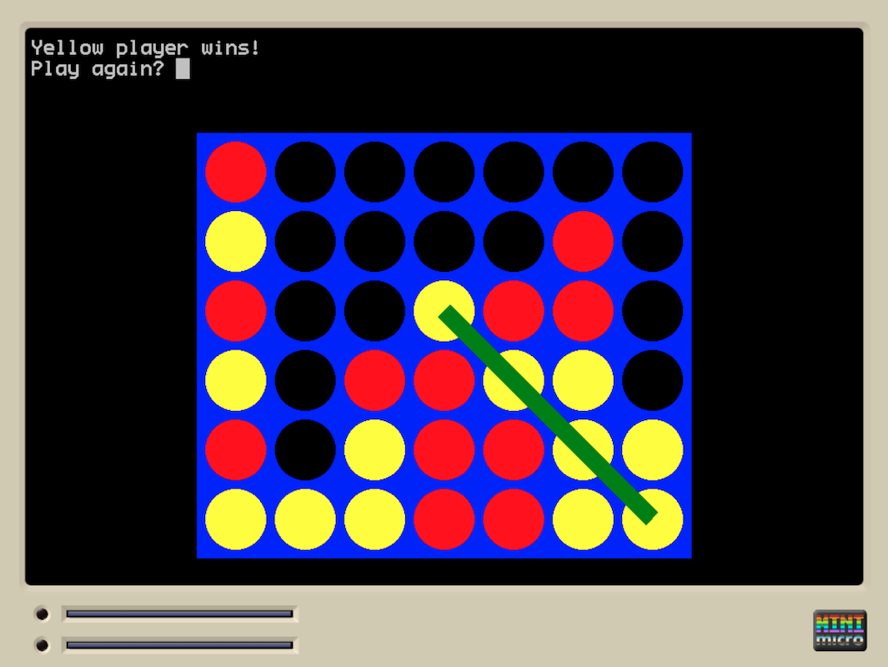

# Connect-Four Game for the Mini Micro

This is a simple connect-four game for the [Mini Micro](https://miniscript.org/MiniMicro/index.html).

This version of the game is for two players.

## Gameplay

Each player takes turn to drop a colored piece into the board.

The first player to "connect" four of their pieces wins.

## Play online

Try it online here:

https://sebnozzi.itch.io/connect-four

